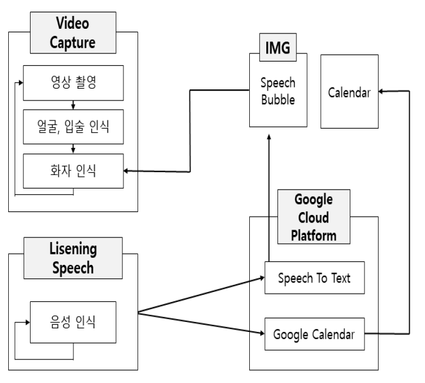

# VOICE-CATCHER

1. [프로젝트 설명 및 사용방법](#프로젝트_설명_및_사용방법)
2. [시스템 구성도](#시스템_구성도)
2. [데모](#데모)
3. [설치환경](#설치환경)
4. [라이브러리 설치 및 환경 설정](#라이브러리_설치_및_환경설정)

## 프로젝트_설명_및_사용방법
### 프로젝트 설명
저희 프로그램은 opencv 와 dlib를 사용하여 웹캠에서 보이는 사람들의 얼굴과 입술을 인식합니다. 또한 Google Cloud Platform의 Speech to text API를 사용하여 마이크로 통해 들어오는 음성을 텍스트화하여 인식된 얼굴 옆에 말풍선을 사용해 띄워줍니다. 이 때 인식된 얼굴들 중에 누가 말했는지 알기위해 입술의 변화를 이용하여 인식하였습니다. 

### 시스템 구성도

### 사용방법
1. 프로젝트 실행에 필요한 라이브러리를 다운받아 줍니다.
2. Google Cloud Platform 에 프로젝트를 만듭니다.
3. Google Cloud Platform에서 Speech To Text API와 Calendar API를 사용설정합니다.
4. 비공개 키 .json 파일을 다운받고 경로를 등록해줍니다.
5. Oauth 클라이언트 ID를 만들어 credentials.json를 다운받아 프로젝트 폴더 안에 넣어줍니다.
6. Main.py를 실행합니다. (저희는 Pycham에서 실행하였습니다.)

## 데모
[데모영상](https://youtu.be/DjnEKcIg3a8)

## 설치환경
본 프로젝트는 Window 환경에서 Anaconda Python을 사용하여 구현되었습니다.

1. Opencv 3.4.3 이상
2. imutils 0.51 버전
3. dlib 19.4.0 이상
4. google-cloud-speech 0.36.0 이상
5. PIL 5.2.0 이상
6. konlpy 0.5.1 이상
7. google-api-python-client 1.7.4 이상
8. oauth2client 4.1.3 이상

## 라이브러리_설치_및_환경설정
### Anaconda 가상환경 생성
 * [Anaconda 가상환경 생성방법](http://circlestate.tistory.com/3)

### Opencv 설치
 * [Python Opencv 설치법](http://circlestate.tistory.com/4)

### Python Dlib 설치
 * [Python Dlib 설치법](http://circlestate.tistory.com/6)

### Google Cloud Platform Api 사용방법
 * [Google Cloud Platform 사용설정](http://circlestate.tistory.com/8)
 * [Google Cloud Platform 프로젝트 생성](http://circlestate.tistory.com/9)
 * [Google Cloud Platform 서비스 계정 생성](http://circlestate.tistory.com/10)
 * [Google Cloud Platform 환경설정 및 SDK 다운](http://circlestate.tistory.com/11)

	- 링크 참고

 
